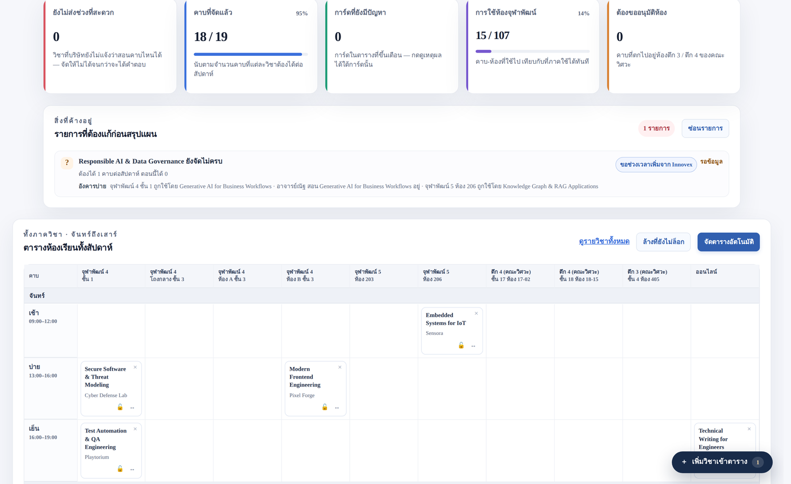
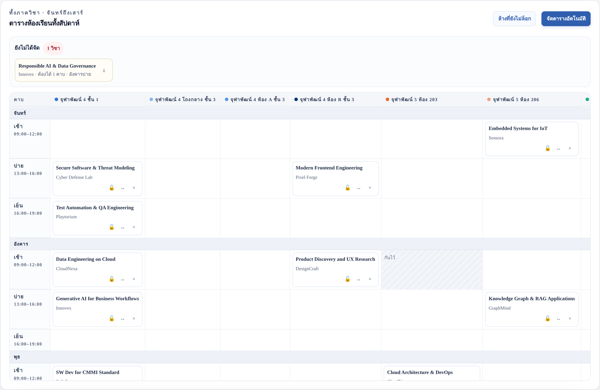
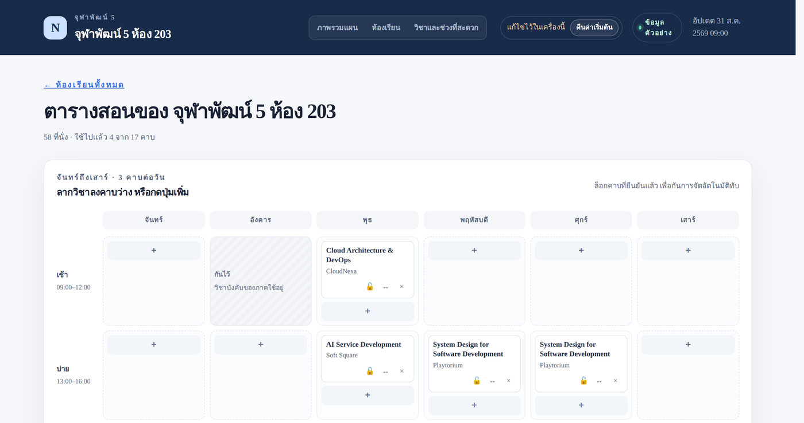

<div align="center">

# 📅 NextLink Elective Schedule Plan

**ระบบวางแผนตารางสอนวิชาเลือก — ภาควิชาวิศวกรรมคอมพิวเตอร์ จุฬาฯ**

จัดคาบและห้องเรียนให้วิชาที่บริษัทภายนอกมาสอน โดยเคารพช่วงเวลาที่แต่ละบริษัทสะดวก


</div>



---

## 🎯 ปัญหาที่แก้

แต่ละบริษัทที่เสนอวิชามาแจ้ง **ช่วงที่สะดวกสอน** ไม่เท่ากัน

| บริษัท | ช่วงที่สะดวก | ผลลัพธ์ |
| --- | --- | --- |
| Company A | พุธเช้า | พิจารณาก่อนวิชาที่มีทางเลือกมากกว่า |
| Company B | พุธเช้า, ศุกร์เย็น | ↪️ ถูกปัดไปศุกร์เย็น |

ระบบพิจารณาวิชาที่ **มีทางเลือกน้อยที่สุดก่อน** — ผลลัพธ์ยังขึ้นกับห้อง ผู้สอน และคาบที่ล็อกไว้
พอถึงคิว Company B พุธเช้าเต็มแล้ว จึงตกไปศุกร์เย็นเอง

> 💡 ไม่มีกฎไหนในโค้ดที่ระบุชื่อบริษัทเลย — ทุกอย่างเกิดจากการเรียงลำดับตามจำนวนทางเลือกที่เหลือ

---

## 🚀 เริ่มใช้งาน

```bash
nvm use        # Node.js 22.18 ขึ้นไป
npm ci
npm run dev     # เปิด http://localhost:3000
```

> ⚠️ **ถ้า `node_modules` ติดตั้งค้างอยู่** ให้ลบโฟลเดอร์ `node_modules` ทิ้งก่อน แล้วรัน `npm install` ใหม่จาก terminal บนเครื่องโดยตรง

ไม่ต้องตั้งฐานข้อมูล ไม่ต้องมี `.env` — ข้อมูลตั้งต้นเป็น JSON **ตัวอย่าง** และแผนที่แก้ไว้เก็บใน `localStorage` ของเบราว์เซอร์

Production ใช้ `npm run build && npm start` โดย build จะคัดลอก `.next/static` และ `public` (ถ้ามี) เข้า standalone package ให้ครบ เปิดใช้งานผ่าน HTTPS หรือ localhost เพื่อให้ Web Locks จัดลำดับการเขียนจากหลายแท็บได้

- แผนแยกตามเทอมด้วย `nextlink.plan.v3.<termId>` พร้อม dataset, seedRevision และ revision
- ข้อมูล v1/v2 ย้ายเข้าเทอม 2569-1 เมื่อบันทึกครั้งถัดไป โดยยังเก็บต้นฉบับรุ่นเก่าไว้
- แถบการบันทึกบอกสถานะจริง มีสำรอง/นำเข้า JSON และเลิกทำล่าสุดข้ามหน้าได้
- เมื่อพื้นที่เต็ม ข้อมูลแก้ไขยังอยู่ในหน้านี้ ให้สำรองหรือกดลองบันทึกอีกครั้งก่อนปิดหน้า
- ข้อมูลเสียจะเปิดแผงกู้คืนและให้ดาวน์โหลดต้นฉบับ ไม่เขียนทับอัตโนมัติ
- Undo ย้อนการแก้ไขล่าสุดใน การใช้งานหน้าเว็บนี้ ถ้าแท็บอื่นเขียนต่อแล้วจะไม่ย้อนทับงานนั้น
- จัดตารางใน Web Worker ยกเลิกได้และจำกัดเวลา 30 วินาที ผลที่ยกเลิกไม่แทนแผนเดิม

---

## 🗂️ หน้าในระบบ

| หน้า | ทำอะไร |
| --- | --- |
| `/` | **ภาพรวมแผน** — KPI, รายการที่ต้องแก้, กระดานห้อง × คาบ ที่ลากวางได้ · เพิ่ม/แก้/ลบห้อง และกันคาบให้วิชาบังคับได้จากกระดาน |
| `/rooms` | **รายชื่อห้อง** — แยกกลุ่ม "ใช้ได้ทันที" กับ "ต้องขออนุมัติก่อนใช้" · เพิ่ม แก้ไข และลบห้องได้ |
| `/rooms/[roomId]` | **ตารางสอนของห้องเดียว** — เพิ่ม ลาก ย้าย ล็อก และเอาวิชาออก |
| `/courses/list` | **รายวิชา** — ตารางอ้างอิง ค้นหาในช่องเดียว · สลับเป็น **เช็กลิสต์งานเอกสาร** ได้ · เลือกดูเทอมย้อนหลังได้ · ดาวน์โหลดเป็น Excel |
| `/courses` | **ช่วงที่บริษัทสะดวก** — ติ๊กแก้ได้ทีละคาบ |

### 📤 ดาวน์โหลด Excel

ปุ่ม **ดาวน์โหลด Excel** อยู่ข้างจำนวนวิชาที่พบ ได้ไฟล์ `.xlsx` จริง (ไม่ใช่ CSV
เปลี่ยนนามสกุล) เปิดใน Excel, LibreOffice หรือ Google Sheets ได้ตรง ๆ

- ได้ **แถวที่กรองอยู่ตอนนั้น** ทั้งหมด ไม่ใช่แค่หน้าที่เปิดค้างไว้ — หน้าเป็นเรื่อง
  ของการอ่าน ไม่ใช่ขอบเขตของข้อมูล
- คอลัมน์มากกว่าบนหน้าจอ: เพิ่มรูปแบบการสอน จำนวนสัปดาห์ ที่นั่งขั้นต่ำ ผู้ประสานงาน
  และหมายเหตุ · เทอมที่จบแล้วจะไม่มีคอลัมน์ "สถานะการจัด" กับ "ผู้ประสานงาน" เพราะ
  ไม่มีคำตอบให้
- ชีตที่สองชื่อ **ข้อมูลการส่งออก** บอกเทอม ตัวกรองที่ใช้ เวลาที่ส่งออก และคำเตือนว่า
  เป็นข้อมูลตัวอย่าง — ไฟล์ที่หลุดไปอยู่ในอีเมลใครสักคนต้องอธิบายตัวเองได้
- ไฟล์ถูกสร้างในเบราว์เซอร์ ไม่มีเซิร์ฟเวอร์เข้ามาเกี่ยว และ **ไม่ได้เพิ่ม dependency**
  ตัวเขียนอยู่ที่ `lib/xlsx.ts` (~300 บรรทัด: zip แบบ stored + XML ของ SpreadsheetML)

ชื่อไฟล์เป็น ASCII ล้วนพร้อมวันที่ เช่น `nextlink-courses-2568-2-20260907.xlsx`

### 🧾 เช็กลิสต์งานเอกสาร

เหนือตารางมีปุ่มสลับสองปุ่ม: **ตารางรายวิชา** (ของเดิม) กับ **เช็กลิสต์งานเอกสาร**
กดแล้วตารางเปลี่ยนเป็นรายการงานที่เจ้าหน้าที่ต้องทำต่อวิชา โดยยังมีคอลัมน์วิชากับ
บริษัทไว้ให้จำแถวได้

| ช่อง | ตัวเลือก |
| :--- | :--- |
| ทำจดหมายเชิญ | ยังไม่ได้รับ · กำลังดำเนินการ · ได้รับแล้ว |
| ทำจดหมายและแจ้งจำนวนชั่วโมงสอน | ยังไม่ได้รับ · กำลังดำเนินการ · ได้รับแล้ว |
| แจ้งให้ อ. พิเศษ ขอสิทธิ์เป็น instructor กับ MCV | ยังไม่เสร็จ · เสร็จแล้ว |
| ดึงอาจารย์พี่เลี้ยง | ยังไม่เสร็จ · เสร็จแล้ว |
| ดึงอาจารย์พิเศษเข้า | ยังไม่เสร็จ · เสร็จแล้ว |
| รหัส Join MCV สำหรับนิสิต | พิมพ์เอง |
| ดึงนิสิตเข้า MCV | ยังไม่เสร็จ · เสร็จแล้ว |

- **สองแบบของคำตอบ เพราะเป็นคำถามคนละชนิด** จดหมายเป็นสิ่งที่ *รอ* จึงมีสถานะ
  กลางว่ากำลังดำเนินการ ส่วนงานใน MCV เจ้าหน้าที่ทำเอง — เสร็จหรือยังไม่เสร็จเท่านั้น
- ตัวกรอง **สถานะเช็กลิสต์** (ยังทำไม่ครบ / ครบแล้ว) มาแทนที่ตัวกรองสถานะการจัด
  เฉพาะตอนอยู่โหมดนี้ · แถวที่ครบทั้ง 7 ช่องจะมีพื้นหลังเขียวจาง
- **รหัส Join MCV นับว่าเสร็จเมื่อมีรหัสจริง** ช่องว่างหรือเว้นวรรคล้วนไม่นับ
- ปุ่มดาวน์โหลด Excel ทำตามมุมมองที่เปิดอยู่ — โหมดเช็กลิสต์ได้ไฟล์
  `nextlink-checklist-...xlsx` ที่มี 7 ช่องนี้พร้อมคอลัมน์ "ทำครบหรือยัง"
- เช็กลิสต์เป็นของ **เทอมที่กำลังจัด** เท่านั้น เลือกเทอมย้อนหลังเมื่อไรปุ่มสลับจะหายไป
  เพราะงานเอกสารของเทอมที่ปิดแล้วไม่มีอะไรให้ติ๊กต่อ
- ที่อยู่ของหน้าจะพ่วง `?view=checklist` ส่งลิงก์ให้คนอื่นเปิดเจอโหมดเดียวกัน

### 🕘 เทอมย้อนหลัง

หน้ารายวิชามีตัวเลือก **เทอม / ปีการศึกษา** อยู่มุมขวาบน เลือกได้ตั้งแต่เทอมที่
กำลังจัดย้อนไปถึงเทอมเก่าที่เก็บไว้ ที่อยู่ของหน้าจะพ่วง `?term=2568-2` ไปด้วย
ส่งลิงก์ให้คนอื่นแล้วเปิดเจอเทอมเดียวกัน

เทอมที่จบแล้ว **อ่านได้อย่างเดียว** — เป็นบันทึกว่าเปิดวิชาอะไร บริษัทแจ้งช่วงไหนไว้
และสอนจริงคาบไหนห้องไหน ไม่ใช่แผนที่ยังขยับได้ หน้าอื่นทั้งหมด (ภาพรวม ห้องเรียน
ช่วงที่สะดวก) ยังทำงานกับเทอมปัจจุบันเท่านั้น เพราะ "จัดใหม่" กับเทอมที่ผ่านไปแล้ว
ไม่มีความหมาย

ชื่อห้องในบันทึกเก่าเก็บเป็น *ข้อความ* ไม่ใช่ `roomId` ห้องที่ถูกยุบหรือเปลี่ยนเลข
ไปแล้วจึงยังแสดงชื่อเดิมที่ใช้ตอนนั้นได้ และการแก้ `data/plan-rooms.json` วันนี้
ไม่ย้อนไปเขียนประวัติ

### 🎛️ กระดานห้อง × คาบ



หัวใจของหน้าภาพรวม: คอลัมน์เป็นห้อง แถวเป็นคาบของแต่ละวัน ลากวิชาย้ายไปมาได้
และลากวิชาที่ยังจัดไม่ได้จากแถบด้านบนลงกระดานได้เลย

ระหว่างลาก ช่องที่ **ขอบเขียว** คือผ่านข้อจำกัด การวางขัดกับช่วงที่สะดวกหรือการใช้ห้องจะขึ้นเตือน
แต่ไม่อนุญาตคาบซ้ำ วิชาในห้องเรียนที่ไม่มีห้อง หรือการย้ายคาบที่ล็อกไว้ ทำได้ทั้งด้วยเมาส์และคีย์บอร์ด — กดปุ่ม `↔` บนการ์ด หรือ `⤓`
บนวิชาใน layer แล้วทุกช่องจะกลายเป็นปุ่ม

วิชาที่ยังจัดไม่ได้อยู่หลังปุ่มลอยมุมขวาล่าง กดแล้วจะเปิด layer ที่ **ติดอยู่บนสุด
ของจอตลอดเวลาที่เลื่อนหน้า** เพื่อให้ลากลงช่องว่างที่อยู่ตรงไหนของสัปดาห์ก็ได้
โดยไม่ต้องเลื่อนกลับขึ้นมาหา

กระดานกว้างพอดีหน้าจอ ไม่มี scrollbar ของตัวเอง (จอแคบกว่า ~1100px จึงกลับไป
เลื่อนแนวนอนในกล่องของมันเอง)

ห้องเรียนไม่มีสีประจำห้อง — ชื่อห้องอยู่บนหัวคอลัมน์อยู่แล้ว ส่วนสีที่ใช้ในระบบมี
อย่างเดียวคือ **สีประจำวันแบบไทย** ในหน้ารายวิชา (จันทร์เหลือง อังคารชมพู พุธเขียว
พฤหัสส้ม ศุกร์ฟ้า เสาร์ม่วง) โดยปรับเฉดให้ตัวหนังสืออ่านออกบนพื้นขาว

### 🚪 ตารางของแต่ละห้อง



ช่องที่ขึ้นขอบแดงจะบอกด้วยว่าแดงเพราะอะไร เช่น
*"CloudNexa ไม่ได้แจ้งว่าสะดวกเสาร์เย็น"*

---

## ⏰ ตารางเวลา

จันทร์–เสาร์ × 3 คาบ = **18 คาบต่อห้องต่อสัปดาห์**

| คาบ | เวลา |
| :--- | :--- |
| 🌅 เช้า | `09:00–12:00` |
| ☀️ บ่าย | `13:00–16:00` |
| 🌆 เย็น | `16:00–19:00` |

> ⚠️ คาบบ่ายกับคาบเย็น **ต่อกันพอดีที่ 16:00** ไม่มีช่วงพักคั่น
> การตรวจว่าเวลาทับกันจึงต้องใช้ช่วงแบบ half-open `[start, end)` เสมอ
> — มีเทสต์คุมไว้ ดู [`docs/data-model.md`](docs/data-model.md)

---

## 🏫 ห้องเรียน

### ✅ ใช้ได้ทันที — จุฬาพัฒน์

| ห้อง | ที่นั่ง |
| :--- | ---: |
| จุฬาพัฒน์ 4 ชั้น 1 | 64 |
| จุฬาพัฒน์ 4 โถงกลาง ชั้น 3 | 236 |
| จุฬาพัฒน์ 4 ห้อง A ชั้น 3 | 64 |
| จุฬาพัฒน์ 4 ห้อง B ชั้น 3 | 30 |
| จุฬาพัฒน์ 5 ห้อง 203 | 58 |
| จุฬาพัฒน์ 5 ห้อง 206 | 36 |

### 🔶 ต้องขออนุมัติก่อนใช้ — อาคารคณะวิศวะฯ

| ห้อง | ที่นั่ง |
| :--- | ---: |
| ตึก 4 ชั้น 17 ห้อง 17-01 | ~40 |
| ตึก 4 ชั้น 17 ห้อง 17-02 | ~40 |
| ตึก 4 ชั้น 18 ห้อง 18-15 | ~30 |
| ตึก 4 ชั้น 18 ห้อง 18-16 | ~40 |
| ตึกร้อยปี ห้อง 401–405 | ~50 (ห้องละ) |
| ตึก 3 ชั้น 4 ห้อง 405 | ~50 |

> ระบบค้นหาในห้อง `READY` ก่อน แล้วจึงเปิดห้อง `NEEDS_APPROVAL` เมื่อยังมีวิชาจัดไม่ลง
> รอบ fallback ย้ายคาบที่ไม่ได้ล็อกได้ และเลือกห้อง READY ก่อนคะแนนอื่นในกลุ่มตัวเลือกเดียวกัน
> การค้นหาย้อนกลับลึกไม่เกิน 2 ชั้น จึงไม่รับประกันคำตอบที่ดีที่สุดหรือพิสูจน์ว่าไม่มีคำตอบ

> ℹ️ ตัวเลขที่มี `~` ยังไม่ได้ยืนยันกับผู้ดูแลอาคาร ระบบถือเป็น **ขอบล่าง**
> และจะไม่จัดวิชาที่รับเกินตัวเลขนี้ลงไป แก้ให้เป็นตัวเลขที่ยืนยันแล้วได้ในฟอร์มห้อง

### ✏️ แก้ไขรายการห้อง

รายชื่อห้องไม่ใช่ค่าคงที่ — ภาคได้ห้องเพิ่มและเสียห้องไปทุกเทอม จึงแก้ได้จากหน้าเว็บ
สองที่: ปุ่ม **＋ เพิ่มห้องเรียน** กับปุ่ม **แก้ไข** บนการ์ดในหน้าห้องเรียน และปุ่ม
**＋ เพิ่มห้อง** กับไอคอนดินสอบนหัวคอลัมน์ในกระดานหน้าภาพรวม

ฟอร์มเดียวกันทั้งเพิ่ม แก้ และลบ เลือกได้ว่าห้องอยู่หมวด "ใช้ได้ทันที" หรือ
"ต้องขออนุมัติก่อนใช้" — หมวดนี้คือสิ่งที่ทำให้ระบบเลือกห้องจุฬาพัฒน์ก่อนเสมอ

- **ลบห้องที่มีวิชาอยู่** วิชาในห้องนั้นจะกลับไปเป็น "ยังไม่ได้จัด" ในคอมมิตเดียวกัน
  กด **เลิกทำ** ครั้งเดียวได้คืนทั้งห้องและทั้งคาบ
- ห้องที่มาจาก `data/plan-rooms.json` ถูก **ซ่อน** ไม่ใช่ลบจริง กด "คืนค่าเริ่มต้น"
  แล้วกลับมา ส่วนห้องที่เพิ่มเองจะหายไปเลย
- การแก้ทั้งหมดอยู่ใน `localStorage` ของเครื่องนั้น ถ้าอยากให้ทุกคนเห็นต้องแก้ที่
  `data/plan-rooms.json`

### 🔒 กันคาบไว้ให้วิชาบังคับ

ห้องของภาคไม่ได้ว่างทั้งสัปดาห์ — วิชาบังคับจองไว้ก่อนแล้ว ในกระดานหน้าภาพรวม
ชี้ที่ช่องว่างแล้วกด **กันคาบ** พิมพ์ได้ว่ากันไว้ให้อะไร เช่น `2110101 Computer
Programming` (หน้าตารางของห้องเดียวก็มีปุ่มเดียวกัน)

คาบที่กันไว้ **ไม่ใช่โน้ตเฉย ๆ** — เป็น `blockedSlots` ตัวเดียวกับที่ scheduler
เคารพมาตลอด จัดตารางอัตโนมัติจะข้ามไป และลากวิชามาวางไม่ได้ กดที่ช่องนั้นอีกครั้ง
เพื่อแก้ข้อความหรือปลดการกัน

---

## 🤖 การจัดตารางอัตโนมัติ

`planSchedule()` ใน [`lib/scheduler.ts`](lib/scheduler.ts) เป็น pure function
ไม่มีนาฬิกา ไม่มี random รันซ้ำด้วย input เดิมได้ผลเดิมทุกครั้ง

1. **คาบที่ล็อกไว้ถูกยึดก่อน** และจะไม่ถูกย้ายไม่ว่ากรณีใด
2. **เรียงวิชาแบบ most-constrained-first** — วิชาที่มีทางเลือกเหลือน้อยที่สุดจัดก่อน
3. **ให้คะแนนทุกคู่ (คาบ, ห้อง)** ที่ผ่านข้อจำกัดแข็ง แล้วเลือกคะแนนสูงสุด
4. **ถ้าไม่มีที่ลง ลองย้ายวิชาที่กันอยู่** เฉพาะที่ไม่ได้ล็อก ลึกไม่เกิน 2 ชั้น
5. **ถ้ายังไม่ได้ จะไม่วางทับ** แต่รายงานเหตุผลรายคาบพร้อมปุ่มทางออก

<details>
<summary><b>น้ำหนักที่ใช้ให้คะแนน</b> (แก้ได้ที่ <code>SCHEDULER_WEIGHTS</code>)</summary>

<br>

| น้ำหนัก | กติกา | เหตุผล |
| ---: | :--- | :--- |
| `+40` | บริษัทเดียวกันได้วันเดียวกัน | วิทยากรเดินทางมาครั้งเดียว สอนได้หลายวิชา |
| `+25` | เลี่ยงคาบเย็น | คาบเย็นนิสิตมาน้อย |
| `+20` | เลี่ยงวันเสาร์ | เสาร์เปิดใช้ แต่ไม่ควรเติมก่อนวันธรรมดา |
| `+20` | ไม่ชนกับวิชาหมวดเดียวกัน | ถ้าชน นิสิตเลือกได้ตัวเดียว |
| `+15` | ขนาดห้องพอดี | กันวิชา 30 คนไปกินโถง 236 ที่นั่ง |
| `+10` | ภาระต่อวันสมดุล | ไม่กระจุกวันเดียว |
| `−30` | ใช้ห้องใหญ่เกินจำเป็น | เก็บโถงกลางไว้ให้วิชาที่รับเยอะจริง |
| `−50` | วิชาเดียวกันซ้ำวันเดียวกัน | วิชา 2 คาบ/สัปดาห์ ควรอยู่คนละวัน |

**ลำดับตึกไม่ได้อยู่ในตารางนี้โดยตั้งใจ** — ดูหัวข้อห้องเรียนด้านบน

</details>

> การแก้มือที่ขัดกับ availability ความจุหรือการใช้ห้องจะแสดงคำเตือน
> ส่วนคาบซ้ำ เวลาผิดรูปแบบ ห้องที่ไม่มีอยู่ และวิชา ON_SITE/HYBRID ที่ไม่มีห้องจะถูกปฏิเสธ
> Scheduler และตัวตรวจปัญหาใช้ policy เดียวกัน: บริษัทเดียวกันเป็นทีมสอนเดียวโดยค่าเริ่มต้น

---

## ✅ ตรวจงาน

```bash
npm run check
npm run build
npx playwright install chromium
npm run check:browser
npm audit --omit=dev
```

| คำสั่ง | ตรวจอะไร |
| :--- | :--- |
| `tsc --noEmit` | ชนิดข้อมูล |
| `npm run check:css` | รูปแบบที่เคยทำให้ `globals.css` พังมาแล้วจริง |
| `npm run check:pages` | ความสม่ำเสมอข้ามหน้า และคลาส CSS ที่ไม่มีใครใช้แล้ว |
| `npm run check:scheduler` | 13 เคสของอัลกอริทึมจัดตาราง |
| `npm run check:integrity` | fallback, stable id, คาบซ้ำ, ห้อง และเวลา |
| `npm run check:storage` | หลายแท็บ พื้นที่เต็ม recovery migration และ undo |
| `npm run check:seed` | archive ซ้ำ ผู้สอนชน และรูปแบบห้อง/การสอน |
| `npm run check:metrics` | นิยาม KPI และค่า URL ที่ไม่ถูกต้อง |
| `npm run check:browser` | regression ผ่าน Chromium กับ standalone production server |
| `npm run check:rooms` | 14 เคสของการเพิ่ม/แก้/ลบห้อง การกันคาบ และข้อมูลห้องตั้งต้น |
| `npm run check:checklist` | 10 เคสของเช็กลิสต์งานเอกสาร (นับครบ, ค่าขยะใน storage, การบันทึกทีละช่อง) |
| `npm run check:xlsx` | 16 เคสของตัวเขียนไฟล์ `.xlsx` และคอลัมน์ที่ส่งออกทั้งสองมุมมอง |

หมายเหตุ: ระบบ **ไม่** เตือนเวลาสองวิชาในหมวดเดียวกันอยู่คาบเดียวกัน — scheduler
ยังพยายามเลี่ยงให้ (น้ำหนัก +20) แต่ไม่รายงานเป็นปัญหา เพราะมี 18 คาบต่อสัปดาห์
และระบบไม่รู้ว่านิสิตลงกี่วิชาต่อเทอม จึงตัดสินแทนไม่ได้

`check:scheduler`, `check:rooms`, `check:checklist` กับ `check:xlsx` รัน TypeScript ตรง ๆ ด้วย `node --experimental-strip-types` — ไม่มี build stepสำหรับ pure-function checks; browser checks ใช้ Playwright กับ production build

> ℹ️ ในข้อมูลตัวอย่าง วิชา **21105814 Responsible AI & Data Governance** ตั้งใจให้จัดไม่ลง
> (บริษัทเดียวกันส่งวิทยากรคนเดียว และว่างคาบเดียวกับอีกวิชาหนึ่ง)
> เพื่อให้เห็นหน้าจอตอนหา slot ให้ไม่ได้ — มีเทสต์คุมไว้ว่าต้องเหลือวิชานี้วิชาเดียว

---

## 📁 โครงสร้างโปรเจกต์

```
app/                    หน้าเว็บ (App Router) + globals.css
components/
  plan-shell.tsx        กรอบหน้าที่ทุกหน้าใช้ร่วมกัน
  plan-overview.tsx     หน้าภาพรวม
  room-list.tsx         รายชื่อห้อง
  room-schedule.tsx     ตารางสอนของห้องเดียว
  availability-editor.tsx  แก้ช่วงที่บริษัทสะดวก
  week-grid.tsx         ตารางสัปดาห์ (ใช้ซ้ำทั้งสองหน้า)
  plan-matrix.tsx       กระดานห้อง × คาบ ที่ลากวางได้
  course-list.tsx       ตารางอ้างอิงรายวิชา
  room-dialog.tsx       ฟอร์มเพิ่ม/แก้/ลบห้อง (ใช้ร่วมกันสองหน้า)
  booking-dialog.tsx    ฟอร์มกันคาบให้วิชาบังคับ
lib/
  rooms.ts              กติกาของรายการห้อง (merge/เพิ่ม/ลบ/กันคาบ) แบบ pure
  checklist.ts          เช็กลิสต์งานเอกสารของแต่ละวิชา (ช่อง สถานะ การนับครบ)
  xlsx.ts               ตัวเขียนไฟล์ .xlsx ขนาดเล็ก (ไม่มี dependency)
  course-export.ts      แปลงรายวิชาที่กรองอยู่เป็นชีต Excel
  slots.ts              คำศัพท์คาบเรียนและเลขคณิตเวลา
  day-colors.ts         สีประจำวันสำหรับรายวิชา
  plan-types.ts         type ของโดเมนทั้งหมด
  plan-data.ts          จุดเดียวที่รู้ว่าข้อมูลมาจากไหน
  scheduler.ts          อัลกอริทึมจัดตาราง (pure)
  conflicts.ts          ตรวจแผนที่แก้มือแล้ว
  use-plan-state.ts     provider ร่วม + commands + derived state
  plan-store.ts         บันทึกข้ามแท็บ + undo + recovery
  plan-document.ts      validation + migration + term/seed revision
  scheduler.worker.ts   ค้นหาตารางนอก main thread
data/                   ข้อมูลตั้งต้น (JSON)
  plan-courses.json     วิชาของเทอมที่กำลังจัด
  plan-rooms.json       ห้องเรียน
  terms/index.json      ทุกเทอมที่ระบบรู้จัก (ใหม่ไปเก่า)
  terms/<id>.json       บันทึกของเทอมที่จบแล้ว หนึ่งไฟล์ต่อหนึ่งเทอม
docs/                   เอกสารและสคีมาของรุ่นก่อน
```

---

## 🧭 ที่ยังไม่ได้ทำ

- [ ] **ฐานข้อมูลจริง** — ต้องมี API, authentication/authorization, transaction, revision และ server validation เพิ่มจากตัวโหลด seed
- [ ] **ผู้ใช้หลายคนบนหลายเครื่อง** — ตอนนี้ซิงก์เฉพาะแท็บ origin เดียวกันในเบราว์เซอร์เดียว
- [ ] **ปฏิทินรายสัปดาห์จริง** — สัปดาห์ที่ 1–10, วันหยุด, ชดเชย
- [x] **Export เป็น `.xlsx`** ทั้งรายวิชาและเช็กลิสต์
- [ ] **Export เป็น `.ics`** ต้องนิยามวันสอนจริงและวันหยุดก่อน

---

## 📚 เอกสารเพิ่มเติม

| เอกสาร | เนื้อหา |
| :--- | :--- |
| [`docs/data-model.md`](docs/data-model.md) | เหตุผลเบื้องหลังโครงสร้างข้อมูล |
| [`docs/schedule-plan-implementation.md`](docs/schedule-plan-implementation.md) | บันทึกการตัดสินใจระหว่างพัฒนา |
| [`docs/legacy/`](docs/legacy/) | สคีมาและข้อมูลของรุ่น dashboard เดิม |
